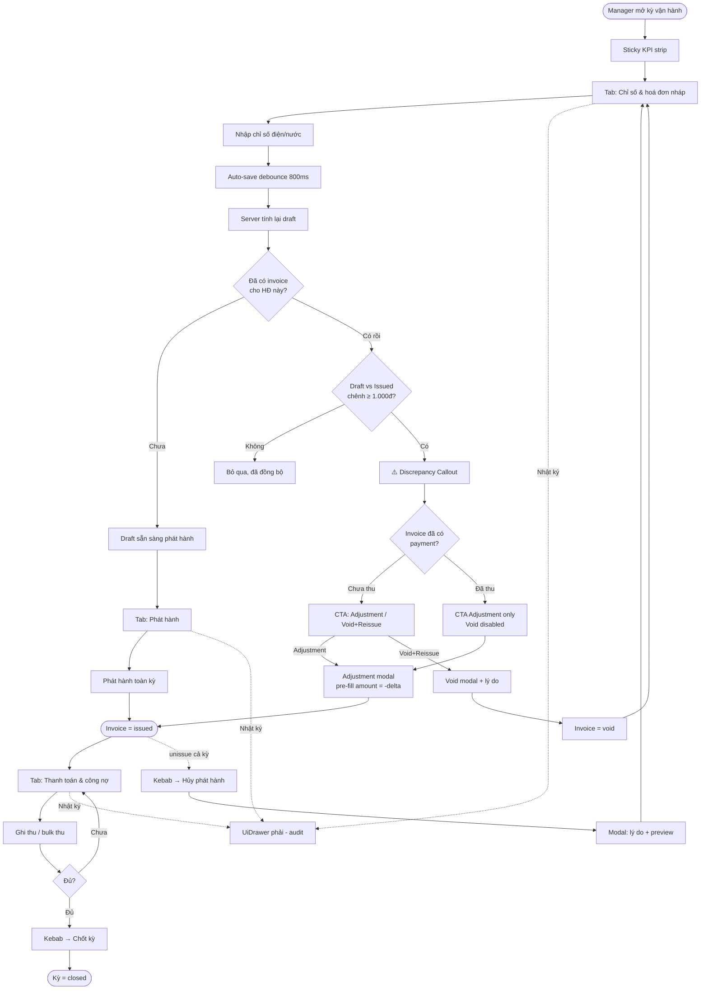

# Zeno House — Trạng thái dự án (31/05/2026)

Hệ thống quản lý bất động sản cho chủ nhà trọ/tòa nhà.

---

## Stack

| Layer | Tech |
|-------|------|
| Framework | Nuxt 4 (`future.compatibilityVersion: 4`), Vue 3, TypeScript strict |
| Styling | TailwindCSS + `clsx` |
| State | Pinia (global) + composables (domain/server state) |
| Auth + DB | Supabase (`@nuxtjs/supabase`) |
| Validation | Zod v4 |
| Icons | SVG via `nuxt-svgo` (auto-import prefix `Icon`) |
| Font | Inter variable — self-hosted `/public/fonts/` |
| Email | Resend API |
| Bot protection | Cloudflare Turnstile |

---

## Database (20 migrations)

| File | Nội dung |
|------|----------|
| `20260514000000` | `buildings` table |
| `20260514000001` | Fix buildings RLS |
| `20260514000002` | `rooms` table |
| `20260514000003` | Drop `buildings.total_rooms` column |
| `20260514000004` | `tenants` table |
| `20260514000005` | `room_assignments` table (deprecated) |
| `20260515000000` | `contracts` table |
| `20260517000000` | Building operational config (area, floors, type) |
| `20260517000001` | Contract commercial terms (price, deposit, payment day) |
| `20260517000002` | Occupants + meter_devices (meter_devices sau bị drop) |
| `20260517000003` | `contract_payments` table |
| `20260517000004` | Contract renewal columns |
| `20260517000005` | `contract_renewals` table |
| `20260517000006` | Occupant uniqueness constraint |
| `20260530000000` | DROP `room_assignments` (thay bằng contracts) |
| `20260530100000` | Tenant enrichment: +gender, occupation, id_issued_*, emergency_contact_* |
| `20260530200000–05` | `service_catalog` (8 items), `building_services`, `contract_services`, seed, migrate, drop old JSONB column |
| `20260530300000` | `meter_readings` table |
| `20260530400000` | Simplify meter model: DROP `meter_devices`, đổi UNIQUE key sang `(room_id, meter_type, period_year, period_month, reading_type)` |

---

## Domain Entities

### Buildings
- CRUD: list (`/buildings`), create, edit, detail
- Detail page: thông tin tòa nhà, danh sách phòng, link tới settings & meter-readings
- **Settings** (`/buildings/[id]/settings`): cấu hình 8 dịch vụ mặc định (toggle + amount + pricing_type), bảng matrix cross-tab cho active contracts, nút đồng bộ dịch vụ vào hợp đồng
- **Meter Readings** (`/buildings/[id]/meter-readings`): chọn kỳ (tháng/năm), nhập hàng loạt điện/nước cho từng phòng, hiện consumption so với kỳ trước, bulk upsert

### Rooms
- CRUD: list, create, edit, detail
- Status: `available` / `occupied` / `maintenance`
- Detail page: thông tin phòng, hợp đồng đang active (tenant, link), lịch sử hợp đồng (không hiển thị nhập chỉ số đồng hồ — monthly readings thuộc không gian Vận hành tháng)
- Nút "Giao phòng" (admin, khi available) → navigate `/contracts/create?room_id=...`
- Nút "Thu phòng" (admin, khi có active contract) → terminate contract → room về `available`
- **Side-effects tự động**: tạo contract → room `occupied`; terminate/expire → room `available` (bỏ qua nếu đang `maintenance`)

### Tenants
- CRUD: list, create, edit, detail
- **Enriched profile**: gender, nghề nghiệp, ngày cấp / nơi cấp CCCD, liên hệ khẩn cấp (tên + phone)
- Detail page: thông tin cá nhân đầy đủ, hợp đồng active, lịch sử hợp đồng

### Contracts *(entity trung tâm)*
- CRUD: list, create wizard, edit, detail
- **Commercial terms**: giá thuê, tiền cọc, ngày thanh toán, chu kỳ hợp đồng
- **Occupants/Roommates**: thêm người ở cùng, ghi nhận ngày dọn ra, xóa
- **Payments**: add/edit/delete (deposit, prepaid_rent, rent, other), hiện tổng tiền đã thanh toán
- **Renewals**: gia hạn tại chỗ (extend) hoặc tạo hợp đồng mới (new_contract) → auto navigate sang contract mới
- **Contract Services**: kế thừa từ building services khi tạo (clone), chỉnh sửa per-contract (amount, quantity, is_enabled, notes)
- **Handover Readings**: 2 rows cố định (điện / nước) cho handover_in (khi tạo) và handover_out (chỉ khi terminated/expired)
- Status: `active` / `expired` / `terminated`

### Meter Readings
- Model đơn giản: `(room_id, meter_type, period_year, period_month, reading_type)`
- `reading_type`: `monthly` | `handover_in` | `handover_out`
- API: `GET/POST /api/meter-readings`, `GET/POST /api/meter-readings/bulk`, `PATCH /api/meter-readings/[id]`

### Service Catalog & Services
- **8 catalog items** cố định: điện, nước, internet, rác, xe máy/ô tô, vệ sinh, thang máy, bảo vệ
- **building_services**: override giá/trạng thái/pricing_type per building
- **contract_services**: clone từ building khi tạo contract, chỉnh sửa per contract (amount, quantity, is_enabled, notes)
- `pricing_type`: `fixed` | `per_person` | `per_unit`
- Đồng bộ: nút sync thêm dịch vụ còn thiếu vào hợp đồng active của building

### Dashboard
- Summary cards: số tòa nhà, phòng available/occupied/maintenance, hợp đồng active, tổng tenant

---

## Server Layer (API → Service → Repository)

**12 domain groups** trong `server/`:

| Group | Endpoints chính |
|-------|-----------------|
| `buildings` | GET list, POST, GET detail, PATCH, DELETE |
| `rooms` | GET list, POST, GET detail, PATCH, DELETE |
| `tenants` | GET list, POST, GET detail, PATCH, DELETE |
| `contracts` | GET list, POST, GET detail, PATCH, DELETE |
| `service-catalog` | GET list |
| `building-services` | GET list, POST upsert, PATCH |
| `contract-services` | GET list, PATCH |
| `meter-readings` | GET, POST, PATCH, GET bulk, POST bulk |
| `dashboard` | GET summary |
| `contract-occupants` | GET, POST, PATCH (move-out), DELETE |
| `contract-payments` | GET, POST, PATCH, DELETE |
| `contract-renewals` | GET, POST |

Mỗi group: **repository** (Supabase query only) → **service** (business logic + permission check) → **API handler** (Zod validate + auth guard + response envelope)

**Response envelope:**
```ts
type ApiSuccess<T> = { data: T; meta?: Record<string, unknown> }
type ApiError   = { error: { code: string; message: string; details?: unknown } }
```

---

## Client Layer

### Composables (23 files)

| Domain | Files |
|--------|-------|
| buildings | `useBuildingList`, `useBuildingDetail`, `useBuildingForm`, `useBuildingServices`, `useBuildingMeterReadings`, `useBuildingContractServices` |
| rooms | `useRoomList`, `useRoomDetail`, `useRoomForm` |
| tenants | `useTenantList`, `useTenantDetail`, `useTenantForm` |
| contracts | `useContractList`, `useContractDetail`, `useContractForm`, `useContractOccupants`, `useContractPayments`, `useContractRenewals`, `useContractServices`, `useContractHandoverReadings` |
| misc | `useDashboardSummary` |

### Components

**UI Primitives** (`app/components/ui/`):
- `UiButton`, `UiInput`, `UiModal`, `UiConfirmModal`, `UiSkeleton`, `UiStatusBadge`, `UiEmptyState`

**App Shell** (`app/components/app/`):
- `AppSidebar`, `AppHeader`, `AppStatCard`

**Domain Components:**
| Domain | Components |
|--------|------------|
| buildings | `BuildingCard`, `BuildingForm`, `BuildingServiceSettings`, `BuildingServicesMatrix`, `MeterReadingBulkInput` |
| rooms | `RoomCard`, `RoomForm` |
| tenants | `TenantForm` |
| contracts | `ContractForm`, `ContractOccupantForm`, `ContractPaymentForm`, `ContractRenewalForm`, `ContractServicesTab`, `ContractHandoverReadings` |

### Pages

| Route | Page |
|-------|------|
| `/` | Dashboard (summary cards) |
| `/login` | Auth page |
| `/buildings` | List |
| `/buildings/create` | Create form |
| `/buildings/[id]` | Detail (rooms, links to settings/meter-readings) |
| `/buildings/[id]/edit` | Edit form |
| `/buildings/[id]/settings` | Service settings + matrix |
| `/buildings/[id]/meter-readings` | Bulk meter reading input |
| `/rooms` | List |
| `/rooms/create` | Create form |
| `/rooms/[id]` | Detail (active contract, history) |
| `/rooms/[id]/edit` | Edit form |
| `/tenants` | List |
| `/tenants/create` | Create form |
| `/tenants/[id]` | Detail (full profile, contracts) |
| `/tenants/[id]/edit` | Edit form |
| `/contracts` | List |
| `/contracts/create` | Create wizard (pre-fill từ `?room_id=`) |
| `/contracts/[id]` | Detail (tất cả sections) |
| `/contracts/[id]/edit` | Edit form |

### Validators (Zod schemas, dùng chung client + server)
`buildings`, `rooms`, `tenants`, `contracts`, `contract-occupants`, `contract-payments`, `contract-renewals`, `contract-services`, `building-services`, `meter-readings`

### Mappers (DB row → DTO)
`buildings`, `rooms`, `tenants`, `contracts`, `contract-occupants`, `contract-payments`, `contract-renewals`, `contract-services`, `building-services`, `service-catalog`, `meter-readings`

---

## Auth & Permissions

- Supabase Auth (email/password)
- Roles: `admin` (full access), `manager` (building được phân công)
- Route guard: `auth.global.ts` middleware
- Capabilities check trong `server/utils/permissions.ts`
- `useAuthStore` (Pinia): session, user, role, `isAdmin`

---

## Data Flow

```
page
 └─▶ composable ($fetch / useFetch)
       └─▶ server/api/   (Zod validate, auth guard)
             └─▶ server/services/   (business logic, permission check)
                   └─▶ server/repositories/   (Supabase query)
```

Client **không** gọi Supabase trực tiếp cho business data.

---

## Những gì chưa có (out of scope v0.1–v0.2.5)

- Invoice / billing module
- Tenant portal (role `tenant`)
- Notification / email flow (Resend API đã setup, chưa dùng)
- Google Analytics (key đã có trong env, chưa integrate UI)
- CI pipeline (spec có, chưa implement)

---

## v0.2.5 cleanup update (12/06/2026)

- Billing workspace readability polish landed: invoice/payment/audit DTOs now carry display fields so primary UI columns can show tenant, room, actor, entity label, and Vietnamese audit summaries instead of raw UUIDs.
- Billing workspace IA is reduced to three primary tabs with a sticky KPI strip, audit in `UiDrawer`, and close-period in a header overflow action.
- Design system now includes `UiDrawer`, `UiToastHost`, and `useToast` patterns for billing mutation feedback.

---

## Billing workspace — trạng thái & roadmap (12/06/2026)

### 3 OpenSpec change đang mở

| Change | Mục tiêu | Trạng thái |
|--------|----------|-----------|
| `billing-readability-and-polish` | Bỏ UID khỏi cột chính, gom IA 3 tab, drawer audit, kebab Chốt kỳ, toast, **callout chênh lệch draft↔issued** | ✅ section 1–13 đã code; ⏳ section 14 (discrepancy callout, 8 task) chưa làm |
| `billing-power-features` | Bulk paste chỉ số, bulk thanh toán, **hủy phát hành cả kỳ** (`billing.unissue`), export Excel | ⏳ chưa bắt đầu |
| `billing-test-baseline` | Vitest + fixtures + unit/integration cho service & composable billing | ⏳ chưa bắt đầu |

Mọi change đều `npx openspec validate <id> --strict` pass. Spec sống ở `openspec/changes/<id>/`.

### Bug đã sửa khi smoke-test

- **Void không tính lại draft**: `app/pages/billing/[building]/[period].vue` `@reload` thiếu `loadDrafts()` + `loadGrid()`. Fix bằng named function `reloadAfterInvoiceChange()` gọi đủ 4 loader.
- **Tab name lệch**: `BillingIssueStep.vue` còn ghi "Soát hoá đơn" sau khi merge tab → đổi thành "Chỉ số & hoá đơn nháp".

### Nguyên tắc bất di bất dịch

1. **Invoice `issued` là immutable.** Không có endpoint nào sửa số tiền của invoice đã phát hành.
2. **Mọi thay đổi đi qua đúng 3 lối**:
   - `void + reissue` — chỉ khi invoice **chưa có payment** và kỳ chưa close.
   - `adjustment` — khi invoice **đã có payment**, tạo dòng điều chỉnh (delta âm = hoàn, dương = thu thêm).
   - `unissue` (cả kỳ) — admin only, dùng khi cấu hình lệch hàng loạt; sẽ void invoice chưa thu, giữ invoice đã thu.
3. **Mọi destructive action** (void / unissue / close) bắt buộc nhập **lý do ≥10 ký tự**, lưu vào audit metadata, format ra summary tiếng Việt qua `formatAuditSummary`.
4. **UI dẫn đường, không tự động.** Override chỉ số sau phát hành KHÔNG tự update invoice — UI hiện callout đề xuất, manager phải bấm CTA.
5. **Không lộ UID** ở cột chính bất kỳ bảng nào. UID chỉ trong drawer "Chi tiết kỹ thuật" hoặc tooltip.

### Flow tổng (sau khi 3 change land)



### 4 case xử lý lệch số

| Case | Khi nào | Action |
|------|---------|--------|
| Happy path | Lần đầu phát hành kỳ | Nhập chỉ số → Phát hành → Thu → Chốt |
| Override sau phát hành (chưa thu) | Phát hiện sai trước khi khách trả | Override → Callout → **Hủy + Phát hành lại** |
| Override sau phát hành (đã thu) | Phát hiện sai sau khi đã thu | Override → Callout → **Tạo điều chỉnh** |
| Sai cấu hình cả kỳ | Phát hành nhầm hàng loạt (vd giá điện sai) | Kebab → **Hủy phát hành kỳ** (admin) → fix config → phát hành lại |

### Section 14 — Discrepancy callout (chưa làm, 8 task)

Tóm tắt từ `openspec/changes/billing-readability-and-polish/tasks.md` group 14:

1. **Server**: extend draft response per contract với `existingInvoice: { id, totalAmount, paidAmount, status } | null` (source: `activeInvoiceByContract` đã có trong `server/services/billing/drafts.ts`).
2. **Types**: thêm field vào `BillingDraftInvoice` ở `app/types/billing.ts`.
3. **Component mới**: `app/components/billing/BillingDraftDiscrepancyCallout.vue`
   - Render khi `existingInvoice` tồn tại và `|delta| ≥ 1000`
   - 2 CTA với rule: paid → disable Void; closed → ẩn cả 2
   - Emit `intent:adjustment` `{ invoiceId, amount: -delta, label }` và `intent:void-reissue` `{ invoiceId }`
4. **Mount** trong row expanded của `BillingDraftGridStep.vue`, gần warnings.
5. **Bubble intent** lên `[period].vue`: switch sang tab payments, focus invoice row, mở modal pre-filled.
6. **`BillingPaymentsStep.vue`** nhận inbound intent (prop hoặc shared store) → mở modal đúng.
7. **`useBillingInvoiceActions`** thêm shortcut `referenceInvoiceId` + `label` cho adjustment payload.
8. **Smoke test** end-to-end.

### Files chính trong billing workspace

| File | Vai trò |
|------|---------|
| `app/pages/billing/[building]/[period].vue` | Workspace 3 tab + sticky KPI + drawer + kebab |
| `app/components/billing/BillingKpiStrip.vue` | KPI strip sticky |
| `app/components/billing/BillingDraftGridStep.vue` | Tab 1 — nhập chỉ số + draft grid |
| `app/components/billing/BillingIssueStep.vue` | Tab 2 — phát hành |
| `app/components/billing/BillingPaymentsStep.vue` | Tab 3 — thu tiền + adjustment + void |
| `app/components/billing/BillingAuditStep.vue` | Body của audit drawer |
| `app/components/billing/BillingCloseStep.vue` | Body của modal Chốt kỳ (kebab) |
| `server/services/billing/drafts.ts` | Tính draft per contract, computed `activeInvoiceByContract` |
| `server/services/billing/invoices.ts` | Issue / void / reissue / adjustment |
| `server/services/billing/payments.ts` | Record payment, list payment |
| `server/services/billing/audit.ts` | List audit + enrich qua resolver |
| `server/services/billing/audit-summary.ts` | `formatAuditSummary(action, metadata)` ra tiếng Việt |
| `server/services/billing/display.ts` | `BillingDisplayResolver` batch lookup actors/invoices/contracts |
